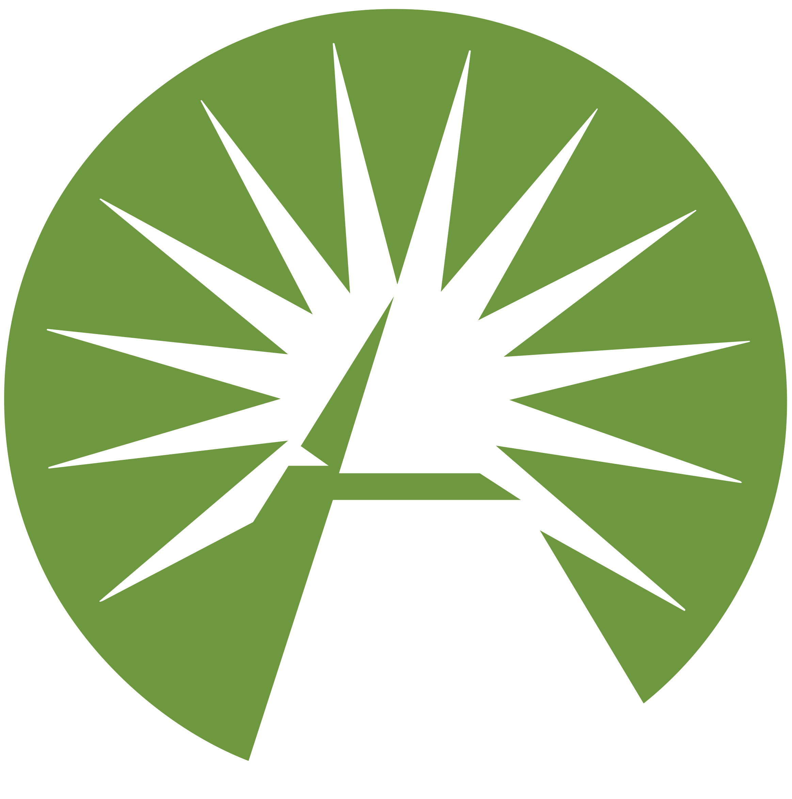
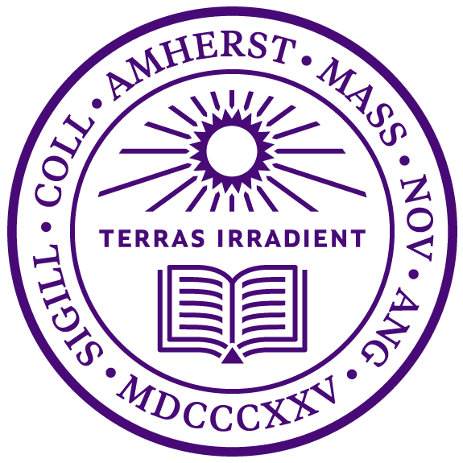

 

Hello! I'm currently a rising senior at Amherst College double majoring in
computer science and mathematics. I'm interested in software engineering and
product management, and I am very fortunate to have interned as a software
engineer at Microsoft, Fidelity Investments, and Health Sqyre, a medical device
e-commerce startup. Most of my experience is in back-end development, but I've
recently been improving my skills in product management.

At Amherst, I'm part of the [Amherst College Data*
Mammoths](https://acdmammoths.github.io/) research and learning group where I
work as a research assistant. Before that, I worked for the Computer Science
Department as both a Teaching Assistant and Peer Tutor for multiple computer
science courses. I am also currently the President of Amherst's Computer Science
Club. Outside of academics, I've held leadership positions in Amherst's Asian
Students Association as Co-Chair of the Asian Men's Collective and as Treasurer
of the Chinese Students Association. As for hobbies, I've grown up playing
cello, guitar, ice hockey, tennis, and rugby!

# Experience

## Microsoft {: width="20%" align="right"}

### Software Engineer Intern, Summer 2021

I am currently interning on the Frontdoor team of Microsoft's Commerce Catalog
group. The team owns a service that scales over 150,000 request per second and
powers the Microsoft Commerce stack for Windows, Xbox, Office, Azure, etc. My
project for this summer is to help other engineers improve their debugging
experience by building diagnostic features for product configuration issues on
their ASP.NET REST APIs and ASP.NET Blazor web applications.

## Fidelity Investments {: width="20%" align="right"}

### Software Engineer Intern, Summer 2020

I interned with the Contact Center Cloud Solutions team and used AWS services to
develop software solutions for Fidelity contact centers. My projects increased
the productivity of branch agents and enhanced customer call experience by
leveraging services such as Amazon Connect, Lambda, Lex, DynamoDB,
Elasticsearch, and SageMaker.

## Health Sqyre {: width="20%" align="right"}

### Software Engineer Intern, Summer 2019

I worked with a team of engineers to develop Flask microservices for the
company's e-commerce platform. I improved the accuracy of patient medical
insurance data by extending the functionality of an existing microservice. I
increased development and testing efficiency by building Flask web applications
for interacting with company utilized APIs. Lastly, I streamlined the company's
partner onboarding process by writing product mapping automation scripts.

## Department of Computer Science of Amherst College {: width="20%" align="right"}

### Research Assistant, Fall 2020 - Spring 2022

I am conducting research as a member of the [Amherst College Data*
Mammoths](https://acdmammoths.github.io/), led by [Matteo
Riondato](https://matteo.rionda.to/). Our research is funded, in part, by the
National Science Foundation and focuses on developing a parallel algorithm for
balanced sampling based on the cube method for stratified populations. This
algorithm increases the computational efficiency for balanced sampling on large
populations.

### Teaching Assistant and Peer Tutor, Spring 2019 - Fall 2020

I help students deepen their understanding of data structures and
object-oriented programming in Java by holding one-hour teaching sessions twice
a week. In these sessions, I improve students' abilities to apply what they
learned from classes by providing guidance on how to approach their weekly
projects and homework assignments.
